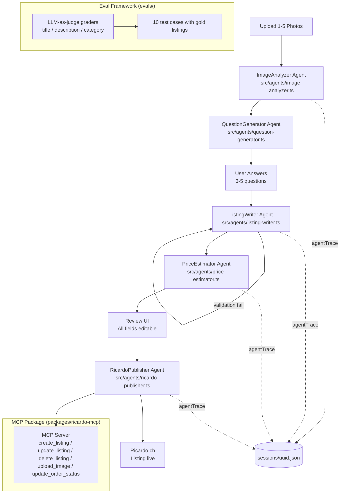

# AI Listing Assistant — Verkaufshilfe via Foto

**Photo → complete Ricardo.ch listing, bilingual DE/FR, in under 2 minutes — powered by an orchestrated AI agent pipeline.**

## What This Is

Upload 1–5 photos of any item you want to sell. The assistant runs an agentic pipeline: image analysis extracts object, condition, and category; a question generator asks only what the photos cannot answer; a listing writer produces a complete, bilingual (DE/FR) Ricardo.ch listing with title, description, price estimate, and shipping conditions; a publisher pushes it live via the Ricardo.ch MCP integration. The result is a publication-ready listing with zero manual copywriting.

This project is also a portfolio demonstration of applied AI engineering. It implements an agentic workflow with typed agent contracts (Zod), self-healing retry logic, LLM-as-judge evaluation with A/B prompt testing, full agent observability via `agentTrace`, and a published MCP server package. Each concept maps to inspectable source code.

## Architecture



Detailed component descriptions: [docs/architecture.md](docs/architecture.md)

## Engineering Decisions

| Concept | Where | Why it matters |
|---------|-------|----------------|
| Agentic pipeline | `src/agents/` | Five typed agents with defined inputs/outputs replace a single monolithic prompt — each agent has a single responsibility and can be tested in isolation |
| Structured outputs (tool_use + Zod) | `src/agents/schemas.ts`, all agent files | `zodOutputFormat` enforces JSON contracts at the SDK layer; no manual JSON parsing or regex extraction in agent code |
| Self-healing agent | `src/agents/listing-writer.ts` | ListingWriter retries on validation failure, feeding the error back to the model — the loop terminates only when the output passes the `ListingValidationSchema` |
| Observability (agentTrace) | `src/types/session.ts` | Every agent call appends a structured `AgentTraceEntry` (model, tokens, duration, input/output) to `SessionState.agentTrace` — full pipeline replay from a single JSON file |
| LLM-as-judge evals | `evals/graders/` | Title, description, and category graders use Claude to score outputs against multi-criterion rubrics — deterministic + probabilistic scores combined |
| Prompt A/B testing | `evals/promptfooconfig.yaml` | Three prompt versions run against 10 fixed test cases; results committed including failures (EVAL-07) — progression tracked in `evals/results/progression.md` |
| MCP server | `packages/ricardo-mcp/` | Published npm package exposing Ricardo.ch API as MCP tools — RicardoPublisher agent calls it at runtime; any MCP-compatible client can use it independently |
| Defense-in-depth security | `src/lib/sanitize.ts`, `src/lib/session.ts`, `.husky/pre-commit` | Session ID validated against path traversal; user answers sanitized against prompt injection; secretlint pre-commit hook blocks credential leaks |

## Setup

```bash
npm install
cp .env.example .env.local
# Edit .env.local — set ANTHROPIC_API_KEY=sk-ant-...
npm run dev
```

Open [http://localhost:3000](http://localhost:3000).

## Running the Evals

```bash
npm run eval:v1   # baseline prompt
npm run eval:v2   # improved title length + description limits
npm run eval:v3   # feature-keyword directive + 3-sentence formula
```

Results are committed to [`evals/results/progression.md`](evals/results/progression.md). Each run JSON is committed alongside, including runs that contain failures.

## Eval Results

| Prompt Version | Title Avg Score | Description Avg Score | Category Exact Match |
|---------------|-----------------|----------------------|----------------------|
| v1 (baseline) | 0.94 | 0.94 | 100% |
| v2 | 0.93 | 0.97 | 100% |
| v3 | 0.93 (9/10 cases) | 0.97 (9/10 cases) | 100% |

Full score breakdown and honest notes on regressions: [`evals/results/progression.md`](evals/results/progression.md)

Eval methodology and grader rubrics: [`docs/eval-report.md`](docs/eval-report.md)

## Project Structure

```
src/
  agents/          # Five typed AI agents (image-analyzer, question-generator,
                   # listing-writer, price-estimator, ricardo-publisher) + schemas
  app/             # Next.js App Router — 5 wizard pages + 8 API routes
  lib/             # Business logic: session persistence, sanitize, anthropic client
  types/           # SessionState, AnalysisResult, Listing, AgentTraceEntry, ...
packages/
  ricardo-mcp/     # Published MCP server package for Ricardo.ch API integration
evals/
  cases/           # 10 test cases with photos, gold-standard listings, user answers
  graders/         # LLM-as-judge graders: title, description, category
  prompts/         # Versioned listing prompts (v1, v2, v3)
  results/         # Committed run JSONs + progression.md score table
docs/
  architecture.md  # Detailed system diagram + component responsibilities
  eval-report.md   # Eval methodology, A/B testing, score progression
  sync-workflow.md # Private-to-public GitHub Actions sync documentation
```

## Tech Stack

- **Next.js 16** — App Router, TypeScript, server-side API routes
- **@anthropic-ai/sdk** — Claude Sonnet 4.6 for all AI calls; `zodOutputFormat` for structured outputs
- **Zod** — Agent output schemas and validation contracts
- **sharp** — Server-side image resizing before API calls
- **Vitest** — Unit tests for agents and graders
- **promptfoo** — A/B prompt evaluation framework
- **MCP SDK** (`@modelcontextprotocol/sdk`) — Ricardo.ch tool server in `packages/ricardo-mcp`

## How This Repo Is Published

The source code lives in a private GitHub repository. A GitHub Actions workflow (`.github/workflows/push-to-public.yml`) syncs an allowlisted subset of files to the public mirror at `github.com/kronprinzmagma/ai-listing-assistant` on every push to `main`. The sync script strips `.env*`, `sessions/`, `uploads/`, and any file matching the secretlint blocklist before pushing. See [`docs/sync-workflow.md`](docs/sync-workflow.md) for the full sync design and allowlist.

## License

MIT
