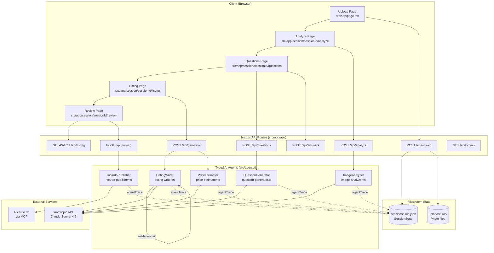

# Architecture

## System Diagram

## Component Responsibilities

| Component | File | Responsibility |
|-----------|------|----------------|
| ImageAnalyzer | `src/agents/image-analyzer.ts` | Resizes photos with sharp, sends to Claude vision, returns `AnalysisResult` (object, condition, category, title/description drafts) |
| QuestionGenerator | `src/agents/question-generator.ts` | Given `AnalysisResult`, generates 3–5 targeted questions about non-visible information only |
| ListingWriter | `src/agents/listing-writer.ts` | Generates complete bilingual (DE/FR) Ricardo.ch listing; retries on `ListingValidationSchema` failure (self-healing loop, PIPE-10) |
| PriceEstimator | `src/agents/price-estimator.ts` | Estimates CHF price with confidence level and rationale based on object and condition |
| RicardoPublisher | `src/agents/ricardo-publisher.ts` | Calls Ricardo.ch MCP tools to create the live listing; stores `publishedListingId` and `publishedUrl` in session |
| Agent orchestrator | `src/agents/index.ts` | Re-exports all agent entry points; documents pipeline order and parallelism (ListingWriter + PriceEstimator run in parallel in /api/generate) |
| Agent schemas | `src/agents/schemas.ts` | Zod schemas for all agent inputs and outputs; `zodOutputFormat` contracts enforced at SDK layer |

## Data Flow — Session State Accumulation

| Step | Fields Added to SessionState | Notes |
|------|------------------------------|-------|
| Upload | `id`, `createdAt`, `photoPaths` | UUID generated; files written to `uploads/{id}/`; session JSON created |
| Analyze | `analysis` (`AnalysisResult`) | `agentTrace[0]` appended; photos passed through sharp resize before API call |
| Questions | `questions` (`Question[]`) | Each question has a generated UUID; `agentTrace[1]` appended |
| Answers | `questions[].answer` populated | User answers pass through `src/lib/sanitize.ts` (`sanitizeUserAnswer`) before being written to session — prompt injection mitigation (REPO-06) |
| Generate | `listing` (`Listing`), `priceEstimate` (`PriceEstimate`) | ListingWriter and PriceEstimator run in parallel; `agentTrace[2]` and `agentTrace[3]` appended |
| Approve | `approved: true` | Set via PATCH /api/listing when user clicks the approval button in Review UI |
| Publish | `publishedListingId`, `publishedUrl` | Set after successful Ricardo.ch MCP call; idempotency guard prevents double-publish |

## Three-Component System

1. **Next.js app (this repo)** — The full-stack wizard: upload UI, agent pipeline, review and edit interface, session state as filesystem JSON. Deployed as a single Node.js server. All AI orchestration lives here.

2. **MCP package (`packages/ricardo-mcp`)** — Published as `@nilsseiter/ricardo-mcp` on npm. Implements the Model Context Protocol server exposing Ricardo.ch API operations as typed tools: `list_listings`, `create_listing`, `update_listing`, `get_orders`. The RicardoPublisher agent connects to this server at runtime. Any MCP-compatible client (Claude desktop, other agents) can use this package independently.

3. **Private/public sync (`.github/workflows/push-to-public.yml`)** — A GitHub Actions workflow runs on every push to `main` in the private repository. It applies an allowlist filter (strips `.env*`, `sessions/`, `uploads/`, and files matching the secretlint blocklist) and force-pushes the cleaned tree to the public mirror at `github.com/kronprinzmagma/ai-listing-assistant`. See [`sync-workflow.md`](sync-workflow.md) for the full design and allowlist.

## Security Controls

| Control | File | Threat Mitigated |
|---------|------|------------------|
| `validateSessionId` | `src/lib/session.ts` | Path traversal (REPO-05) — session IDs are validated against a UUID pattern before any filesystem path construction |
| `sanitizeUserAnswer` | `src/lib/sanitize.ts` | Prompt injection (REPO-06) — user-supplied answers are stripped of LLM control sequences before inclusion in agent prompts |
| secretlint pre-commit hook | `.husky/pre-commit` | Credential leak (REPO-07) — blocks commits containing API key patterns (`sk-ant-api...`); runs on every staged file |
| Allowlist sync workflow | `.github/workflows/push-to-public.yml` | Private data publication (REPO-02/03) — only explicitly allowlisted files reach the public repo; default-deny for new files |
| Zod-typed agent outputs | `src/agents/schemas.ts` (used in all agents via `zodOutputFormat`) | Untyped JSON injection — all Claude responses are parsed and validated against Zod schemas at the SDK layer before use; malformed or unexpected fields are rejected |
